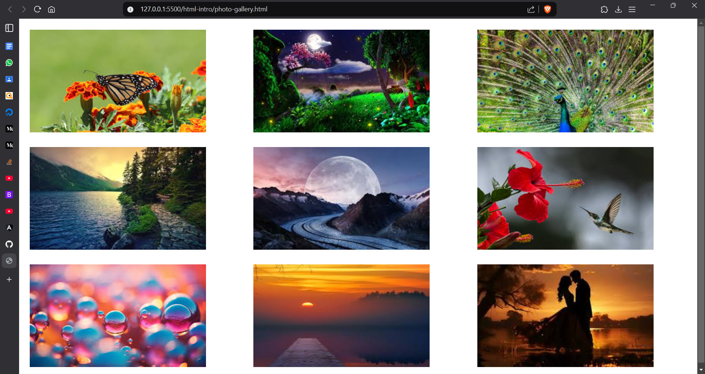
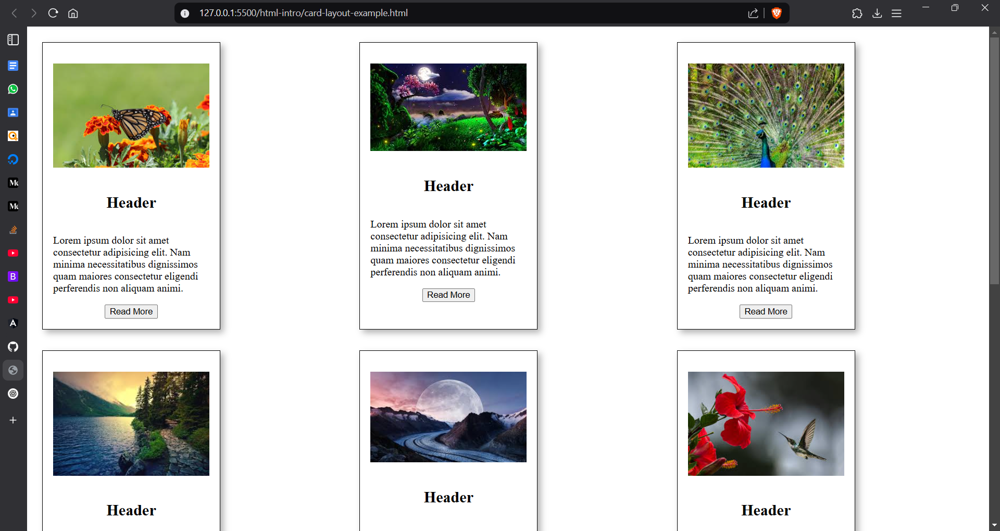
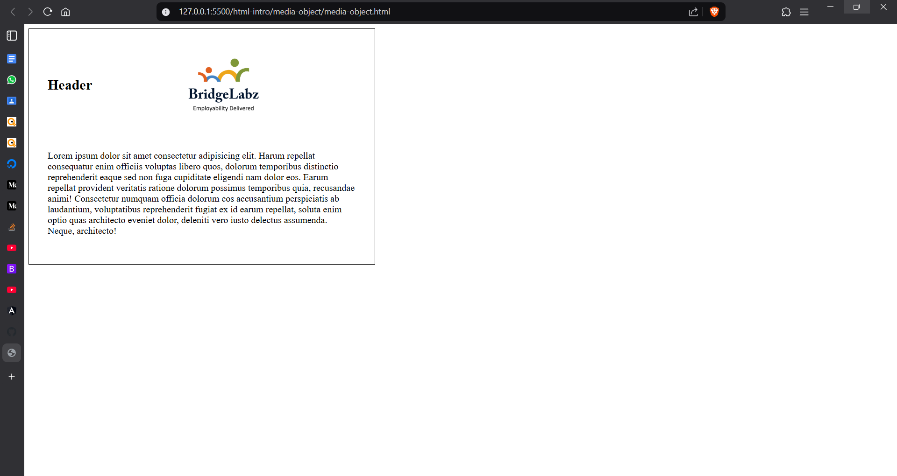
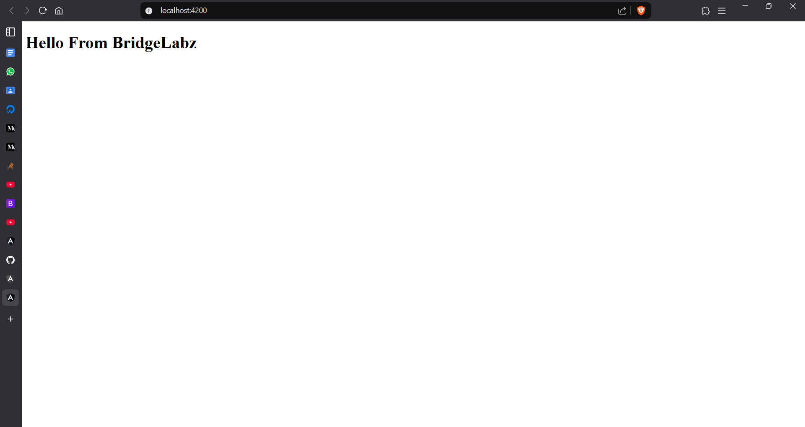
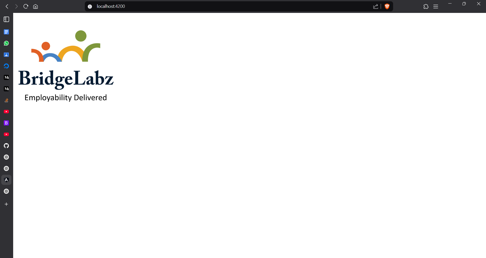

# Project Title

## Overview
This project demonstrates the use of HTML and different technologies to create the view part of the application.

---

## 📷 Adding Images

### 1️⃣ HTML task1 results

### 2️⃣ HTML task2 results

### 3️⃣ HTML task3 results

### 4️⃣ HTML task4 results

### 1️⃣ Angular uc1 results

### 2️⃣ Angular uc2 results

